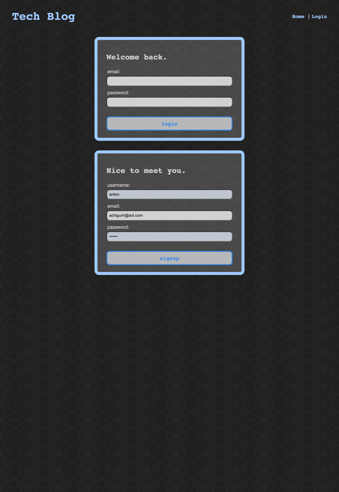
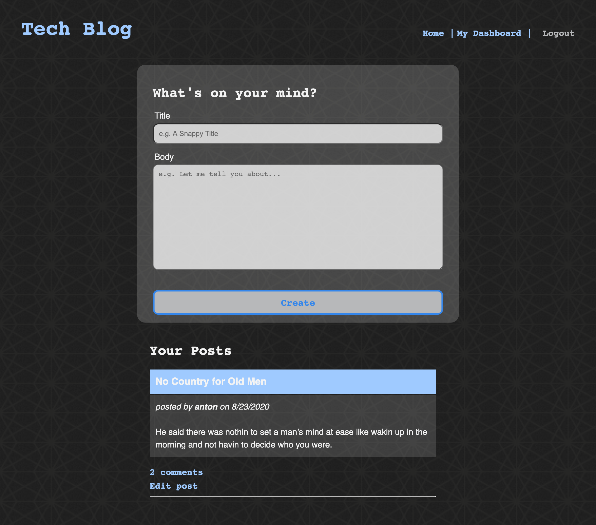

# The Tech Blog
  

  ## Table of Contents
  * [Description](#description)
  * [Installation](#installation)
  * [Usage](#usage)
  * [License](#license)
  * [Contribution Guidelines](#contribution-guidelines)
  * [Questions](#questions)
  

  ## Description  
  Log in to share your thoughts and knowhow with other users! 

  [Link to Live App (Heroku)](https://module14-tech-blog.herokuapp.com/)

  ## Installation
    Download the following dependencies: 
  - bcrypt  
  - connect-session-sequelize
  - dotenv
  - express
  - express-handlebars
  - express-session
  - mysql2
  - sequelize

  ## Usage
   
  
  
  

  ## License
  This project is covered under Unlicense.

  ## Contribution Guidelines
  It's chaos; be kind. 

  ## Questions
  Please direct all inquiries to [jessicajernigan](https://github.com/jessicajernigan) via email at: [jernigan.jessica.leigh@gmail.com](mailto:jernigan.jessica.leigh@gmail.com?subject=Question%20About%20The%20Tech%20Blog)

